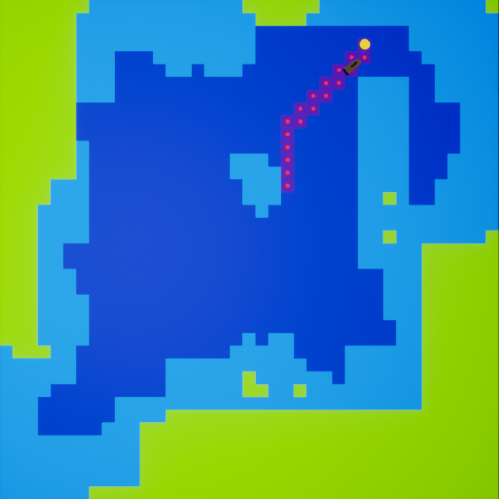

# Artificial Life - Search Assignment
This assignment was developed as part of the unit FIT3094 - Artificial Life at Monash University, in 2022. This assignment is developed using the Unreal Engine 4, using a combination of C++ code and Blueprints.

### Requirements

The following extract is taken from the assignment brief:
> For this assignment, you will be managing the pathfinding component of a single agent to navigate to treasure within a virtual environment. This agent and the environment will be provided within base code for the project, and the focus will be the implementation of active pathfinding. The virtual environment will be fully observable to the agent, and within a discreet world.

>The agent has to find treasure within the virtual environment, navigate to it, and collect it. There is a hard-coded limit on the maximum number of steps a ship may use to identify a path to treasure and to execute that path to collect it.

### Installation
**Unreal Version:** 4.27
**Devices:** Windows / Mac

Installing the repository on a device running the Unreal Engine version will result with the following output when the *Play* button is clicked.

### Algorithms

I have implemented 5 algorithms in this system. They are:
- Depth First Search (DFS)
- Bredth First Search (BFS)
- Unit Cost Search (Dijkstra)
- A-Star (A*)
- Weighted A-Star

Each algorithm can be toggled using the Search feature functionality. There are ten targets that the ship must reach, and in each target, the user is able to select the appropriate algorithm to reach the end goal with. Additionally, with the **Weighted A-Star** algorithm, a weighting can be applied.

The heuristic cost for the deep water (the darker blue) is 1 per unit travelled. The cost for the shallow water (the lighter blue) is 2 per unit travelled. The ground (green) is non-traversable and cannot be navigated through by any algorithm.

#### Results
The following table shows the results of each algorithm for the first three gold paths reached. In the case of DFS, as it exceeded 50 steps in the first goal, the ship's morale was deleted and it was not able to reach the second and third goals.

The following images show the results of the path formed for each of the six algorithms specified for the **first goal**:

 

The above images show the DFS, BFS and Dijkstra algorithms respectively.

 

 

The above images show the A*, Weighted A* (w=1.5) and Weighted A* (w=2.0) algorithms respectively.

